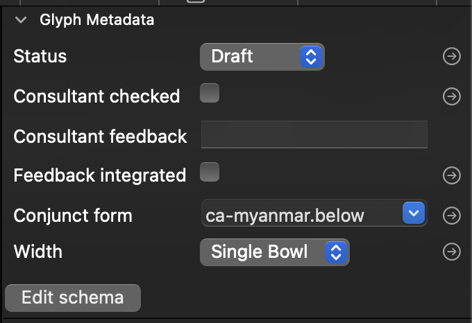

# Glyph Metadata Palette

This plugin for Glyphs3 allows you to associate arbitrary structured metadata to each glyph in your font. Each font can define the data it wants to keep track of, and the palette allows you to view and edit the data for each glyph. 

## Why do I want to do that?

* You could keep track of how finalised your outlines are, any review feedback you have received, and whether that feedback is integrated.
* You can link glyphs with other glyphs.
* You can automatically generate OpenType Layout rules based on your metadata.

## How do I use it?

* First, you need to define the data you want to keep track of. You do this by clicking on the "Edit schema" button. (You can always edit the font's schema later if you need to make changes to it.)
* Each piece of data can be represented by a check box, a dropdown list, a glyph name, or a free text box. For a dropdown list, clicking on the option button in the schema editor will allow you to set the permissible options in the dropdown.
* When your schema is defined, you can begin to set the data on each glyph.
* Clicking the arrow next to a dropdown list will open a new editor tab containing all glyphs in that category. For example, you can see all glyphs where "Outline Status" is "Test".
* Clicking the arrow next to a checkbox will open a new editor tab containing all glyphs in with the same checkbox status. For example, you can see all glyphs where "Feedback Integrated" is "Yes".
* Clicking the arrow next to a glyphname will open a new editor tab containing the linked glyph.
* The palette automatically creates OpenType classes associated with checkboxes and dropdown lists: for example, all glyphs where "Width" is "Single Bowl" are placed in a class called `@Width_Single_Bowl`; all glyphs where "Feedback Integrated" is checked are placed in a class called `@Feedback_Integrated_yes` and those where it is unchecked are placed in a class called `@Feedback_Integrated_no`.
